# DINOv3 Playground

A comprehensive machine learning framework for efficiently extracting, preprocessing, and utilizing self-supervised DINOv3 vision features for 3D biological image segmentation. This framework accelerates training pipelines by **50-200x** through intelligent feature preprocessing and caching.

## Table of Contents

- [Overview](#overview)
- [Key Features](#key-features)
- [Installation](#installation)
- [Architecture](#architecture)
- [Workflows](#workflows)
  - [Preprocessing Workflow](#preprocessing-workflow)
  - [Training Workflow](#training-workflow)
  - [Inference Workflow](#inference-workflow)
- [Quick Start](#quick-start)
- [Module Reference](#module-reference)
- [Data Format](#data-format)
- [Configuration](#configuration)
- [Performance](#performance)
- [Examples](#examples)
- [Contributing](#contributing)

---

## Overview

DINOv3 Playground bridges the gap between expensive on-the-fly feature extraction during training (2-5 seconds per volume) and pre-computed, fast-loading features (~10-50ms per volume). It's designed for 3D biological image analysis, particularly cell segmentation tasks.

### The Problem vs The Solution


---

## Key Features

- **50-200x Training Speedup**: Pre-extract expensive DINOv3 features once
- **Multi-Backbone Support**: Both ViT and ConvNeXt architectures via HuggingFace
- **3D Segmentation**: Purpose-built UNet architectures for volumetric data
- **Advanced Loss Functions**: Focal, Dice, Tversky, and boundary-weighted losses
- **Affinity-Based Training**: Instance segmentation via affinity graphs and LSDs
- **Efficient I/O**: TensorStore/Zarr for parallel, cached data access
- **Cluster Integration**: LSF job submission scripts for parallel preprocessing
- **TensorBoard Integration**: Real-time training visualization with GIF creation
- **AnyUp Support**: Optional high-quality feature upsampling

---

## Installation

```bash
# Create environment
conda create -n dinov3 python=3.11 -y
conda activate dinov3

# Install dependencies
pip install -r requirements.txt
```

### Dependencies

- PyTorch >= 1.9.0 (CUDA optional)
- Transformers >= 4.20.0 (HuggingFace)
- TensorStore (efficient I/O)
- Zarr (storage format)
- NumPy, SciPy, scikit-image
- edt (Euclidean Distance Transform)
- Optional: lsd_lite (C-based LSD computation)

---

## Architecture

### System Architecture

```mermaid
flowchart TB
    subgraph input["📥 INPUT LAYER"]
        RAW[("Raw Volumes<br/>(EM Images)")]
        GT[("Ground Truth<br/>(Labels)")]
        META[("Metadata<br/>(JSON)")]
    end

    subgraph preprocess["⚙️ PREPROCESSING LAYER"]
        CORE[dinov3_core<br/>• ViT/ConvNeXt<br/>• AMP support<br/>• Sliding window]
        AFF[affinity_utils<br/>• Affinities<br/>• LSDs<br/>• Boundaries]
        PREP[dinov3_preprocessing<br/>• Volume I/O<br/>• Caching<br/>• Metadata]
    end

    subgraph storage["💾 STORAGE LAYER (TensorStore/Zarr)"]
        FEAT[(features<br/>C,D,H,W<br/>float16)]
        GTS[(gt<br/>D,H,W<br/>uint32)]
        TGT[(target<br/>Affs,D,H,W<br/>float32)]
        RAWS[(raw<br/>D,H,W<br/>uint8)]
    end

    subgraph loading["📂 DATA LOADING LAYER"]
        PDL[preprocessed_dataloader<br/>• PyTorch Dataset<br/>• Parallel I/O<br/>• Float16 support]
        MET[memory_efficient_training<br/>• On-demand sampling<br/>• Multi-volume batching<br/>• Augmentation]
    end

    subgraph model["🧠 MODEL LAYER"]
        UNET2D[DINOv3UNet<br/>2D]
        UNET3D[DINOv3UNet3D<br/>3D]
        PIPE[DINOv3UNet3D<br/>Pipeline]
        LOSS[Loss Functions<br/>Focal / Dice / Tversky / BoundaryWeighted]
    end

    subgraph output["📤 OUTPUT LAYER"]
        SEG[Segmentation<br/>Predictions]
        TB[TensorBoard<br/>Logs & GIFs]
        CKPT[Checkpoints<br/>& Metadata]
    end

    RAW --> CORE
    GT --> AFF
    META --> PREP
    CORE --> PREP
    AFF --> PREP

    PREP --> FEAT
    PREP --> GTS
    PREP --> TGT
    PREP --> RAWS

    FEAT --> PDL
    GTS --> PDL
    TGT --> PDL
    PDL --> MET

    MET --> UNET2D
    MET --> UNET3D
    MET --> PIPE
    UNET3D --> LOSS

    LOSS --> SEG
    LOSS --> TB
    LOSS --> CKPT
```



### Module Dependencies

```mermaid
flowchart TD
    HF[HuggingFace<br/>Transformers] --> CORE[dinov3_core]

    CORE --> PREP[dinov3_preprocessing]
    CORE --> MODELS[models]
    CORE --> DATA[data_processing]

    PREP --> AFF[affinity_utils<br/>• compute_affs<br/>• compute_lsds<br/>• boundary_wts]

    AFF --> PDL[preprocessed_dataloader]
    MODELS --> PDL
    DATA --> PDL

    PDL --> MET[memory_efficient_training]

    MET --> LOSSES[losses]
    MET --> AUG[augmentations]
    MET --> TBH[tensorboard_helpers]

    style CORE fill:#e1f5fe
    style MET fill:#fff3e0
    style PDL fill:#e8f5e9
```



---

## Workflows

### Preprocessing Workflow


### Training Workflow

```mermaid
flowchart TB
    subgraph init["🚀 INITIALIZATION"]
        LOAD["Load Preprocessed Volumes<br/>PreprocessedDINOv3Dataset<br/>• Scan for metadata.json<br/>• Pre-open TensorStore handles"]
        MODEL["Initialize Model<br/>DINOv3UNet3D<br/>• Input: (B,C,D,H,W)<br/>• Encoder: 4 levels<br/>• Decoder: 4 levels"]
        LOSSFN["Configure Loss<br/>get_loss_function()<br/>• focal<br/>• dice<br/>• boundary_weighted"]
    end

    subgraph epoch["🔄 TRAINING LOOP"]
        subgraph batch["Batch Processing"]
            direction TB
            TS["TensorStore Read<br/>~10-50ms"]
            TENSORS["features: (B,C,D,H,W)<br/>target: (B,A+10,D,H,W)<br/>weights: (B,D,H,W)<br/>mask: (B,D,H,W)"]
            AUG["Augmentation (3D)<br/>• Axis swaps<br/>• 90° rotations<br/>• Brightness/contrast<br/>• Gaussian noise"]
        end

        subgraph forward["Forward Pass"]
            direction TB
            UNET["DINOv3UNet3D"]
            ENC["Encoder<br/>enc1→enc2→enc3→enc4→bottleneck"]
            DEC["Decoder<br/>dec4→dec3→dec2→dec1"]
            SKIP["Skip Connections"]
            PRED["Predictions"]
        end

        subgraph loss["Loss Computation"]
            BWLOSS["BoundaryWeightedAffinityLoss<br/>aff_loss = BCE(pred, target) * weights<br/>lsds_loss = MSE(pred_lsds, target_lsds)<br/>total = aff_loss + λ * lsds_loss"]
        end

        subgraph optim["Optimization"]
            BACK["loss.backward()"]
            STEP["optimizer.step()"]
            SCHED["scheduler.step()"]
        end

        subgraph log["Logging"]
            TBL["TensorBoard: curves, grids"]
            CKP["Checkpoint: weights, config"]
            GIF["GIF: 3D visualization"]
        end
    end

    LOAD --> MODEL --> LOSSFN
    LOSSFN --> TS
    TS --> TENSORS --> AUG
    AUG --> UNET
    UNET --> ENC
    ENC --> DEC
    ENC -.-> SKIP -.-> DEC
    DEC --> PRED
    PRED --> BWLOSS
    BWLOSS --> BACK --> STEP --> SCHED
    SCHED --> TBL & CKP & GIF
    GIF -.-> |Next Epoch| TS
```



### Complete Training Pipeline Overview

```mermaid
%%{init: {'theme': 'dark'}}%%
flowchart TB
    subgraph input["📥 INPUT"]
        IN_DATA["3D Image Volume + Ground Truth"]
    end

    subgraph dataloader["📂 DATALOADER"]
        DL_FEAT["• Parallel I/O via TensorStore<br/>• Threaded prefetching<br/>• Volume pool sampling<br/>• Random cropping"]
    end

    subgraph features["🧠 FEATURE EXTRACTION"]
        FE_DINO["DINOv3 (ViT or ConvNeXt)"]
        FE_3D["3D via orthogonal plane averaging<br/>(XY + XZ + YZ) / 3"]
        UP_OPTS["Upsampling: Bilinear / AnyUp / Learned ConvTranspose"]
    end

    subgraph augment["🔄 AUGMENTATIONS"]
        AUG_LIST["• Geometric: axis swaps, 90° rotations<br/>• Intensity: contrast, gamma, blur, noise<br/>• Structural: streaks, blackout regions"]
    end

    subgraph network["🔮 NETWORK"]
        NET_UNET["3D UNet with skip connections"]
        NET_OPTS["Options: BatchNorm/Renorm / Gradient checkpointing / Context fusion"]
    end

    subgraph targets["🎯 OUTPUT TYPES"]
        TGT_LIST["• Labels: semantic classes<br/>• Affinities: instance edges<br/>• Affinities + LSDs: edges + shape descriptors"]
    end

    subgraph loss["📉 LOSS FUNCTIONS"]
        LOSS_LIST["• Focal: handles class imbalance<br/>• Dice: overlap-based<br/>• Tversky: FP/FN trade-off<br/>• Boundary-Weighted: focus on edges"]
    end

    subgraph output["📤 OUTPUT"]
        OUT_PRED["Predictions + TensorBoard + Checkpoints"]
    end

    input --> dataloader --> features
    FE_DINO --> FE_3D --> UP_OPTS
    UP_OPTS --> augment --> network
    NET_UNET --> NET_OPTS
    network --> targets --> loss --> output
```



### Key Pipeline Options


### UNet Architecture Detail


### Inference Workflow

```mermaid
flowchart TB
    subgraph input["📥 INPUT"]
        VOL["New Raw Volume<br/>(D, H, W)"]
        CKPT["Trained Model<br/>Checkpoint"]
    end

    subgraph load["🔧 MODEL LOADING"]
        INF["DINOv3UNetInference"]
        META["Load metadata<br/>config, hyperparameters"]
        CFG["Reconstruct DINOv3 config<br/>model_id, image_size, stride"]
        WTS["Load model weights"]
    end

    subgraph extract["⚡ FEATURE EXTRACTION"]
        OPT_A["Option A: End-to-End<br/>Raw → DINOv3 → UNet → Predictions<br/>(DINOv3UNet3DPipeline)"]
        OPT_B["Option B: Pre-extracted<br/>Cached Features → UNet → Predictions"]
    end

    subgraph post["🔄 POST-PROCESSING"]
        AFF_PRED["Affinity Predictions"]
        WS["Watershed /<br/>Connected Components"]
        INST["Instance Segmentation"]
    end

    subgraph output["📤 OUTPUT"]
        SEG["Segmentation Mask"]
        AFF_OUT["Affinities<br/>(optional)"]
        VIS["Visualization<br/>(GIF/PNG)"]
    end

    VOL --> INF
    CKPT --> INF
    INF --> META --> CFG --> WTS
    WTS --> OPT_A & OPT_B
    OPT_A & OPT_B --> AFF_PRED
    AFF_PRED --> WS --> INST
    INST --> SEG & AFF_OUT & VIS
```



### Data Flow Overview


---

## Quick Start

### 1. Preprocess a Single Volume

```bash
python dinov3_playground/preprocess_volume.py \
    --volume-index 0 \
    --output-dir /path/to/preprocessed_volumes \
    --organelles cell \
    --num-threads 8
```

### 2. Batch Preprocessing with LSF

```bash
python dinov3_playground/submit_preprocessing_jobs.py \
    --output-dir /path/to/preprocessed_volumes \
    --num-volumes 100 \
    --num-processors 16 \
    --memory-gb 64 \
    --organelles cell \
    --walltime 2:00
```

### 3. Train with Preprocessed Features

```python
from dinov3_playground.preprocessed_dataloader import create_preprocessed_dataloader
from dinov3_playground.models import DINOv3UNet3D
from dinov3_playground.losses import get_loss_function

# Create dataloader
train_loader = create_preprocessed_dataloader(
    preprocessed_dir="/path/to/preprocessed_volumes",
    batch_size=4,
    shuffle=True,
    num_threads=8,
)

# Initialize model
model = DINOv3UNet3D(
    input_channels=384,  # DINOv3 ViT-S feature dim
    num_classes=13,      # 3 affinities + 10 LSDs
    base_channels=64,
)

# Get loss function
criterion = get_loss_function(
    loss_type="boundary_weighted",
    boundary_power=1.0,
    lsds_weight=1.0,
)

# Training loop
for features, target, boundary_weights, mask in train_loader:
    predictions = model(features)
    loss = criterion(predictions, target, boundary_weights, mask)
    loss.backward()
    optimizer.step()
```

### 4. Run Inference

```python
from dinov3_playground.inference import DINOv3UNetInference

# Load trained model
inference = DINOv3UNetInference(checkpoint_dir="/path/to/checkpoints")

# Run inference on new volume
predictions = inference.predict(raw_volume)
```

---

## Module Reference

### Core Modules

| Module | Description |
|--------|-------------|
| [dinov3_core.py](dinov3_playground/dinov3_core.py) | DINOv3 feature extraction (ViT/ConvNeXt) |
| [models.py](dinov3_playground/models.py) | UNet architectures for segmentation |
| [losses.py](dinov3_playground/losses.py) | Loss functions (Focal, Dice, Tversky, etc.) |
| [affinity_utils.py](dinov3_playground/affinity_utils.py) | Affinity and LSD computation |

### Data Handling

| Module | Description |
|--------|-------------|
| [preprocessed_dataloader.py](dinov3_playground/preprocessed_dataloader.py) | Fast PyTorch DataLoader for cached features |
| [data_processing.py](dinov3_playground/data_processing.py) | Sampling and data utilities |
| [augmentations.py](dinov3_playground/augmentations.py) | 3D augmentation transforms |

### Preprocessing

| Module | Description |
|--------|-------------|
| [dinov3_preprocessing.py](dinov3_playground/dinov3_preprocessing.py) | Core preprocessing functions |
| [preprocess_volume.py](dinov3_playground/preprocess_volume.py) | CLI for single volume |
| [submit_preprocessing_jobs.py](dinov3_playground/submit_preprocessing_jobs.py) | LSF job submission |

### Training & Inference

| Module | Description |
|--------|-------------|
| [memory_efficient_training.py](dinov3_playground/memory_efficient_training.py) | Main training system |
| [inference.py](dinov3_playground/inference.py) | Model loading and inference |
| [tensorboard_helpers.py](dinov3_playground/tensorboard_helpers.py) | TensorBoard logging utilities |

---

## Data Format

### Preprocessed Volume Structure

```mermaid
flowchart TB
    subgraph zarr["volume_XXXXXX.zarr/"]
        F["features<br/>(C, D, H, W)<br/>float16 ~4GB"]
        G["gt<br/>(D, H, W)<br/>uint32 ~8MB"]
        T["target<br/>(A+10, D, H, W)<br/>float32 ~100MB"]
        B["boundary_weights<br/>(D, H, W)<br/>float32 ~8MB"]
        M["mask<br/>(D, H, W)<br/>uint8 ~2MB"]
        R["raw<br/>(D, H, W)<br/>uint8 ~2MB"]
    end

    subgraph json["volume_XXXXXX_metadata.json"]
        P["paths → zarr locations"]
        D["dataset_source → origin info"]
        S["random_seed → reproducibility"]
        TM["timing → preprocessing duration"]
        SZ["sizes → storage breakdown"]
        C["config → parameters used"]
    end

    style F fill:#e3f2fd
    style T fill:#fff3e0
    style B fill:#fce4ec
```



### Storage Requirements

| Volume Size | No Compression | LZ4 Compression |
|-------------|----------------|-----------------|
| 128³        | ~4.3 GB        | ~1.7 GB         |
| 1000 volumes| ~4.3 TB        | ~1.7 TB         |

**Recommendation**: Use no compression for training (faster I/O).

---

## Configuration

### DINOv3 Feature Extraction

```python
from dinov3_playground import initialize_dinov3

# Standard extraction
initialize_dinov3(
    model_id="facebook/dinov3-vits16-pretrain-lvd1689m",
    image_size=896,
    device="cuda",
)

# High-resolution with sliding window
process(data, stride=8)  # stride < patch_size (16) for HR
```

### Training Parameters

```python
# DataLoader configuration
create_preprocessed_dataloader(
    preprocessed_dir="/path/to/data",
    batch_size=4,
    num_threads=16,          # TensorStore parallelism
    features_dtype=torch.float16,  # Save memory
    load_boundary_weights=True,
    volume_indices=[0, 1, 2],  # Subset selection
)

# Memory-efficient training
MemoryEfficientDataLoader3D(
    raw_data=raw,
    gt_data=gt,
    target_volume_size=(64, 64, 64),
    train_volume_pool_size=20,
    output_type="affinities_lsds",
    affinity_offsets=[(1,0,0), (0,1,0), (0,0,1)],
    lsds_sigma=20.0,
    use_anyup=False,
)
```

### Loss Functions

```python
from dinov3_playground.losses import get_loss_function

# Focal loss for class imbalance
loss_fn = get_loss_function("focal", gamma=2.0, alpha=[0.25, 0.75])

# Boundary-weighted affinity loss
loss_fn = get_loss_function(
    "boundary_weighted",
    boundary_power=1.0,
    lsds_weight=1.0,
)
```

---

## Performance

### Speed Comparison


| Operation | Time | Notes |
|-----------|------|-------|
| DINOv3 extraction (on-the-fly) | 2-5s/volume | GPU required |
| Load preprocessed (cold) | ~1.5s/volume | First access |
| Load preprocessed (warm) | 10-50ms/volume | Cached |
| **Speedup** | **50-200x** | |

### Optimal Settings

- **Threads**: 8-16 for TensorStore (diminishing returns beyond)
- **Compression**: None for training (storage is cheap, time is expensive)
- **Features dtype**: float16 saves 50% memory with minimal precision loss
- **Storage**: Local SSD >> network storage (10-100x faster)

---

## Examples

See the [examples/](examples/) directory and [QUICKSTART.md](dinov3_playground/QUICKSTART.md) for:

- Single volume preprocessing
- Batch job submission
- Training integration
- Inference examples
- Visualization tutorials

---

## Contributing

Contributions are welcome! Please:

1. Follow the repository's code style
2. Add tests for new functionality
3. Update documentation as needed
4. Submit a pull request

---

## License

See [LICENSE](LICENSE) for details.

---

## Contact

For questions or issues, please open a GitHub issue or contact the maintainers.
